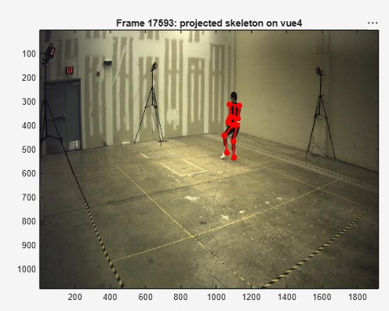
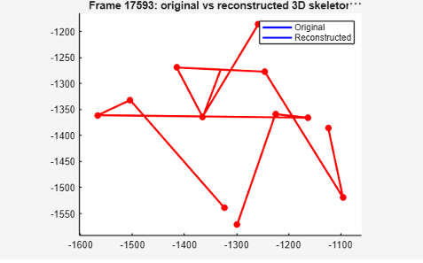
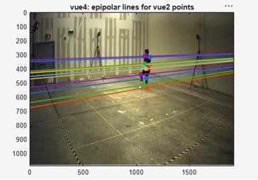

# 3D Reconstruction from Multi-View Images

Forward and inverse camera projection, triangulation, and epipolar geometry visualization. Implemented in MATLAB using real motion capture data.

---

## Overview

This project implements the core geometry that links 3D world coordinates to 2D image pixels and back again. Given two calibrated cameras, the pipeline:

1. **Projects** 3D points into 2D pixel coordinates (forward projection)
2. **Backprojects** 2D pixels into 3D viewing rays (inverse projection)
3. **Triangulates** pairs of rays from two cameras to recover the original 3D point

The pipeline is validated on real motion capture data (~25,000 frames, 12 joints per frame) and achieves reconstruction error on the order of **10⁻¹¹**;essentially perfect, limited only by floating-point precision.

---

## Tech Stack

- MATLAB
- VideoReader (for video frames)
- Motion capture dataset (provided)

---

## Project Structure

```
cv-3d-reconstruction/
├── project3Dto2D.m          # Forward projection: 3D → 2D
├── pixel2DtoRay.m           # Backprojection: 2D → 3D ray
├── triangulate2Rays.m       # Triangulation from two rays
├── computeL2error.m         # Error calculation
├── drawSkeleton.m           # Skeleton visualization (2D/3D)
├── drawEpipolarLine.m       # Epipolar line visualization
├── demo.m                   # Main entry point
├── README.md
├── .gitignore
└── docs/
    ├── report.pdf
    └── images/              # Sample output images
```

---

## How It Works

### 1. Forward Projection (`project3Dto2D`)

A 3D world point is projected into a 2D pixel coordinate using the camera's intrinsic and extrinsic parameters:

1. Apply the camera's projection matrix `Pmat` (extrinsics: rotation + translation)
2. Divide by depth to get normalized image coordinates
3. Apply the camera's intrinsics matrix `Kmat` (focal length, principal point, pixel scale)

```
World Point (X, Y, Z) → Pmat → Normalized Coords → Kmat → Pixel (x, y)
```

### 2. Backprojection (`pixel2DtoRay`)

A 2D pixel coordinate is converted into a 3D viewing ray:

1. Undo the intrinsics matrix `Kmat` to get normalized image coordinates
2. Rotate the direction from camera-frame to world-frame using the camera's rotation matrix
3. Return the camera center (world position) and a unit ray direction

```
Pixel (x, y) → Kmat⁻¹ → Normalized Coords → Rmat → Ray Direction
```

### 3. Triangulation (`triangulate2Rays`)

Given one viewing ray from each camera, find the 3D point closest to both rays:

1. Compute the direction of the shortest segment connecting the two rays
2. Solve for the endpoints along each ray
3. Average the two endpoints to get the final 3D point

```
Ray A (center, direction) + Ray B (center, direction) → 3D Point (X, Y, Z)
```

---

## Results

### Reconstruction Accuracy

The pipeline was validated across the full motion capture sequence (~25,000 frames, 12 joints per frame).

| Metric | Value |
|---|---|
| Mean L2 Error | 1.06 × 10⁻¹¹ |
| Max L2 Error | 3.90 × 10⁻¹¹ |
| Error Standard Deviation | 4.35 × 10⁻¹² |

*(Essentially perfect reconstruction—error is at floating-point precision.)*

### 2D Projections

The 3D joints projected into each camera view overlay accurately on the video frames:



### 3D Reconstruction

Original skeleton (blue) vs. reconstructed skeleton (red). The two overlap almost perfectly:



### Epipolar Geometry

Epipolar lines visualized between the two camera views (right ankle highlighted in green):



---

## How to Run

```matlab
# Open MATLAB and navigate to the project folder
# Run the demo script
>> demo
```

The script will:
1. Load the motion capture data and camera calibration files
2. Project 3D joints into both camera views
3. Reconstruct 3D points from the two views
4. Compute L2 error between original and reconstructed points
5. Display visualizations (2D projections, 3D skeletons, epipolar lines)

---

## What I Learned

- The math behind pinhole camera models (intrinsics, extrinsics, projection matrices)
- How to convert between 3D world coordinates and 2D pixel coordinates
- The importance of ray geometry in multi-view reconstruction
- How to validate a pipeline by comparing reconstructed points to ground truth

---

## Acknowledgments

Adapted from an assignment in the Fundamentals of Computer Vision course at Penn State. Motion capture data and camera calibration files were provided as part of the assignment.

---

## License

This project is for educational and portfolio purposes.
